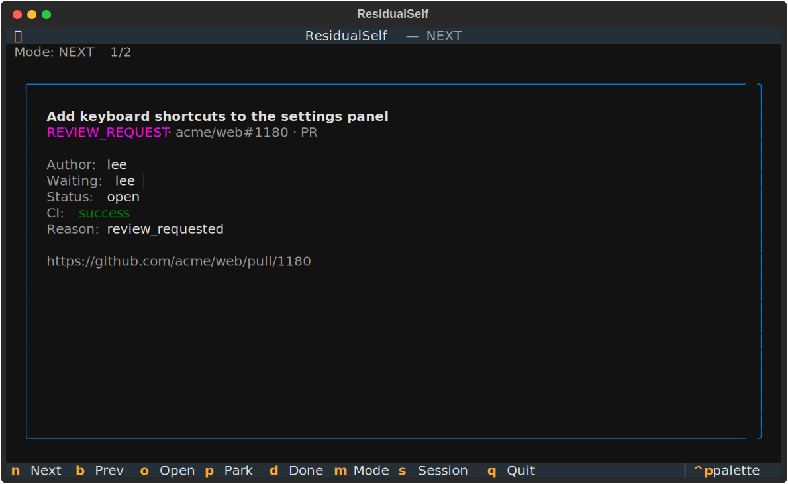

# ResidualSelf

**An ADHD-first, single-focus GitHub work-queue TUI.**

ResidualSelf turns your live GitHub obligations — review requests, assigned issues,
activity on your PRs, CI failures, mentions — into a **one-card-at-a-time**
workflow. It removes the *capture* tax (you never type a task list) and the
*triage* tax (you never scan an inbox). It hands you one thing at a time, and
lets you act on it or park it without guilt and come back later with context
intact.



---

## Why

- **Single-focus.** The default view is ONE item, never a scrollable inbox.
- **Zero manual capture.** The queue comes from GitHub. There is no "add task."
- **Park without guilt.** Snooze an item with a re-entry note; it returns when
  due (or when there's new activity) with that note shown first.
- **Polite API citizen.** Conditional notification polls (`If-Modified-Since`),
  respects `X-Poll-Interval`, never hammers the Search API.
- **Private.** The OAuth token lives only in your OS keychain (via `keyring`) —
  never written to disk, never logged. No telemetry.

---

## Prerequisites (one-time, you do this)

ResidualSelf authenticates with **GitHub's OAuth Device Flow**, so you need an
OAuth App's Client ID (no client secret required):

1. Go to **GitHub → Settings → Developer settings → OAuth Apps → New OAuth App**.
2. Fill in any name/homepage URL. Create the app.
3. On the app's page, **enable "Device Flow."**
4. Copy the **Client ID** and provide it to ResidualSelf, either by:
   - setting an env var: `export RESIDUALSELF_CLIENT_ID=<your_client_id>`, or
   - editing `CLIENT_ID` in `residualself/config.py`.

Scopes requested at login: `notifications read:user repo`. Public-only users may
swap `repo` for `public_repo` (edit `SCOPES` in `residualself/config.py`); note
classic OAuth `repo` is coarse (read/write) — a finer-grained GitHub App is a
possible future option.

---

## Install

With [pipx](https://pipx.pypa.io) (recommended — isolated, on your PATH):

```bash
pipx install .
```

Or with pip in a virtualenv:

```bash
python -m venv .venv && source .venv/bin/activate
pip install -e ".[dev]"     # drop [dev] if you only want to run it
```

Requires **Python 3.11+**.

---

## Usage

```bash
export RESIDUALSELF_CLIENT_ID=<your_oauth_app_client_id>

residualself auth      # log in via Device Flow (token stored in your OS keychain)
residualself whoami    # prints your authenticated GitHub login
residualself list      # one-shot text dump of your actionable queue
residualself run       # launch the single-focus TUI
```

`residualself list` and `run` accept `--mentions` to also include `@`-mentions
(noisier, off by default).

### Keybindings (in `residualself run`)

| Key | Action |
| --- | --- |
| `n` / `→` | Next item |
| `b` / `←` | Previous item |
| `o` | Open the current item in your browser |
| `d` | Done — marks the notification thread read on GitHub, removes the card |
| `p` | Park — capture a re-entry note + optional remind-in (1h / 4h / tomorrow) |
| `m` | Cycle mode (shown in the header) |
| `s` | Start / stop a focus session (Pomodoro) |
| `q` | Quit |

### Modes

- **NEXT** (default) — the single best next thing: items blocking others, then
  failing CI on your PRs, then review requests (oldest first), then assigned
  issues, then your PRs.
- **UNBLOCK_OTHERS** — review requests (oldest first), then PRs where reviewers
  are waiting on you.
- **QUICK_WINS** — likely-small items (`good first`/`small`/etc. labels) first,
  with oldest-activity as a fallback so nothing rots.
- **DEEP_WORK** — your assigned issues and authored PRs, longest-standing first.

### Focus sessions

Press `s` and commit to **25 / 50 minutes** or **3 / 5 items**. A countdown
shows in the UI; marking items done counts toward an item target. Finishing
shows a summary, and the session is logged locally.

---

## How it works

- **Queue** = four GitHub Search queries (`review-requested:@me`, `assignee:@me`,
  `author:@me`, optional `mentions:@me`), unified and deduped into one list.
- **Enrichment** = a single GraphQL query per batch fills in CI status, review
  decision, draft flag, requested reviewers, and the latest comment.
- **Activity & mark-done** = the Notifications API supplies thread ids (for
  mark-as-read) and drives polite background refresh.
- **Park / sessions** = stored locally in SQLite at
  `~/.local/share/residualself/residualself.db`. Polling activity is logged to
  `~/.local/share/residualself/residualself.log`.

Out of scope (for now): submitting reviews/comments in-app (it deep-links out
instead), team features, analytics, mobile.

---

## Develop

```bash
pip install -e ".[dev]"
pytest            # tests (respx-mocked; no live network)
ruff check .      # lint
python tools/make_demo_screenshot.py   # regenerate docs/demo.svg (offline)
```

---

## License & trademarks

[MIT](LICENSE).

ResidualSelf is an independent project and is **not affiliated with, endorsed by,
or sponsored by GitHub, Inc.** "GitHub" and the GitHub logo are trademarks of
GitHub, Inc.; this project references them only to describe interoperability.
